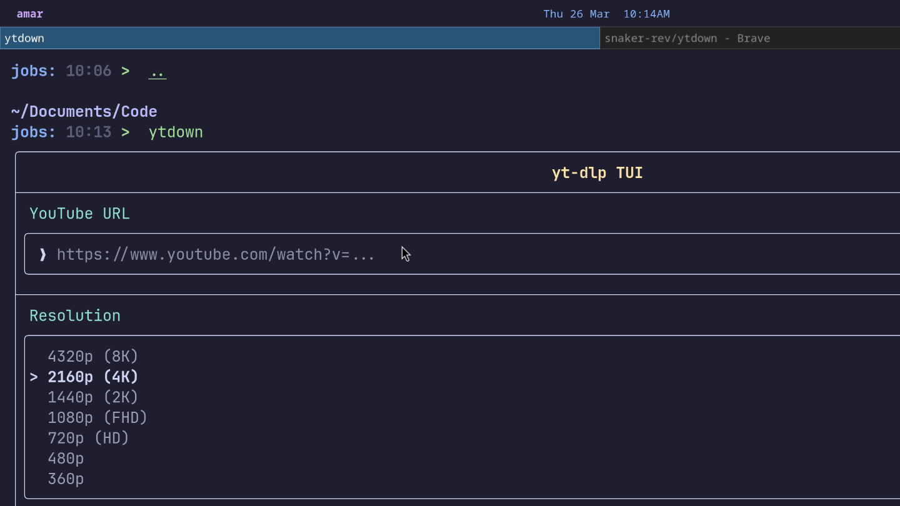

# ytdown

A simple TUI for `yt-dlp` to download videos from YouTube.



## Disclaimer

This tool is designed for **Linux** only. It relies on shell commands and package managers that may not be available on other operating systems.

## Dependencies

*   `yt-dlp`: This tool is a wrapper around `yt-dlp`. You need to have `yt-dlp` installed and available in your `PATH`.
    *   You can find installation instructions here: [https://github.com/yt-dlp/yt-dlp](https://github.com/yt-dlp/yt-dlp)

## Building

To build `ytdown`, you will need a C++20 compatible compiler (like g++ or clang++) and `make` installed.

1.  **Clone the repository**:
    ```bash
    git clone https://github.com/amark2005/ytdown.git
    cd ytdown
    ```

2.  **Build the executable**:
    ```bash
    make
    ```
    This command will first clone the `ftxui` library (a dependency for the TUI) and then compile the `ytdown` executable. The final binary will be located in the root of the project directory.

## Usage

Once you have built the executable, you can run it from the terminal:

```bash
./ytdown
```

This will launch the terminal user interface.

### The Interface

The interface has the following components:

*   **YouTube URL**: An input field to paste the YouTube video URL.
*   **Resolution**: A menu to select the desired video resolution.
*   **Format**: A menu to select the video or audio format.
*   **Download Button**: Starts the download process using `yt-dlp`.
*   **Quit Button**: Exits the application.

For more detailed usage instructions, please refer to the `docs.md` file.


## Installation

You can install `ytdown` to make it available system-wide:

```bash
sudo make install
```

This will install the `ytdown` executable to `/usr/local/bin`.

## Uninstallation

To uninstall `ytdown`:

```bash
sudo make uninstall
```

## License

This project is licensed under the MIT License.
